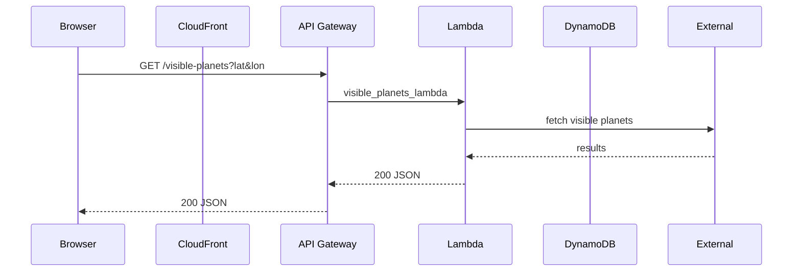

```mermaid
sequenceDiagram
  participant B as Browser
  participant CF as CloudFront
  participant AP as API Gateway
  participant L as Lambda
  participant DB as DynamoDB

  B->>AP: GET /visible-planets?lat&lon
  AP->>L: visible_planets_lambda
  L->>External: fetch visible planets
  External-->>L: results
  L-->>AP: 200 JSON
  AP-->>B: 200 JSON
```
