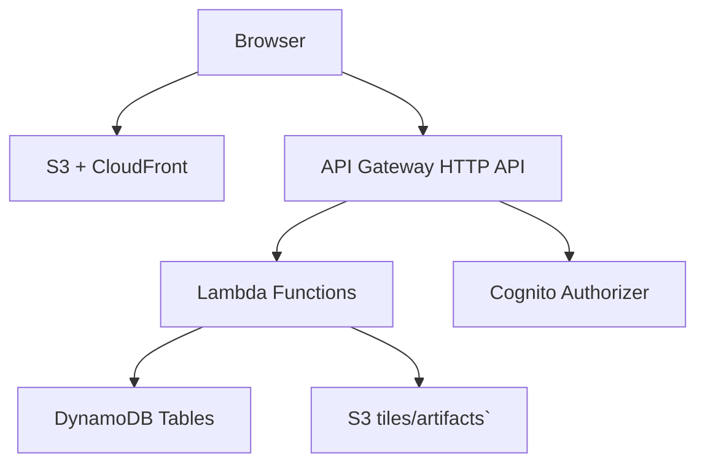

```mermaid
graph TD
  Browser-->CloudFront[S3 + CloudFront]
  Browser-->APIGW[API Gateway HTTP API]
  APIGW-->Lambda[Lambda Functions]
  Lambda-->DynamoDB[DynamoDB Tables]
  Lambda-->S3[S3 tiles/artifacts`]
  APIGW-->Cognito[Cognito Authorizer]
```